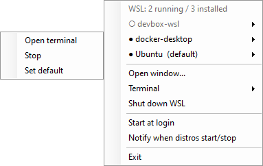
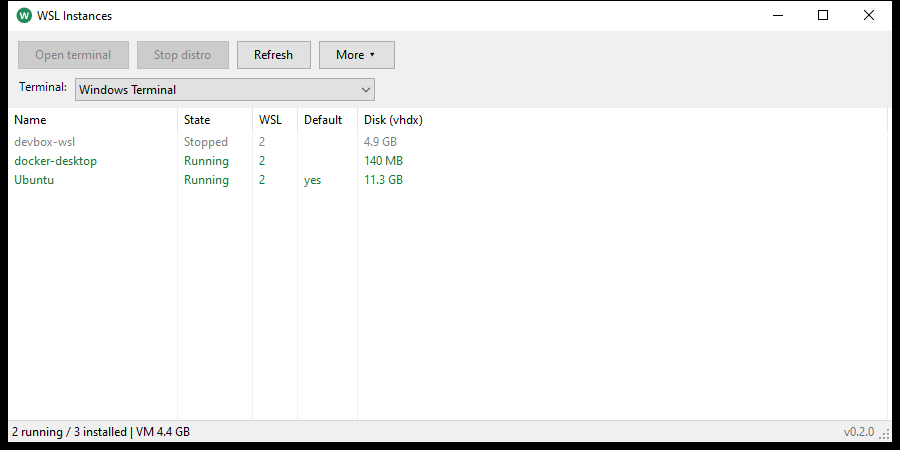

# WslTray

A tiny Windows tray app that shows your WSL2 distros and opens a terminal in any of them.

Click the tray icon for a menu of your distros; open the full window when you want more detail.





## Download

Grab `WslTray.exe` from the [Releases](../../releases) page and run it. The exe is unsigned, so Windows SmartScreen may warn on first launch (More info, then Run anyway).

## Build

Needs only the .NET Framework compiler that ships with Windows:

```
.\build.cmd
```

This produces `bin\WslTray.exe`. Set `WSLTRAY_VERSION` (e.g. `0.1.1`) first to stamp a version; the default is `dev`.

## Use

Run `bin\WslTray.exe`; it sits in the tray. Click the icon (left or right) for the menu:

- **Distros:** running ones are marked `●`, stopped ones `○`. Click one to open a terminal in it; its submenu has **Open terminal**, **Stop** and **Set default**.
- **Open window...** shows the full window (disk size, WSL version, VM memory). Double-click a distro there to open a terminal.

- **Terminal:** pick from the installed terminals (or a custom command using `{name}`) in the tray menu or window. Saved in `HKCU\Software\WslTray`.
- **Flags:** `--show`, `--probe` (JSON state), `--selftest`, `--autostart on|off`.
